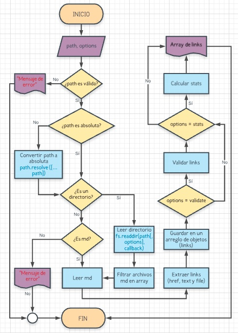
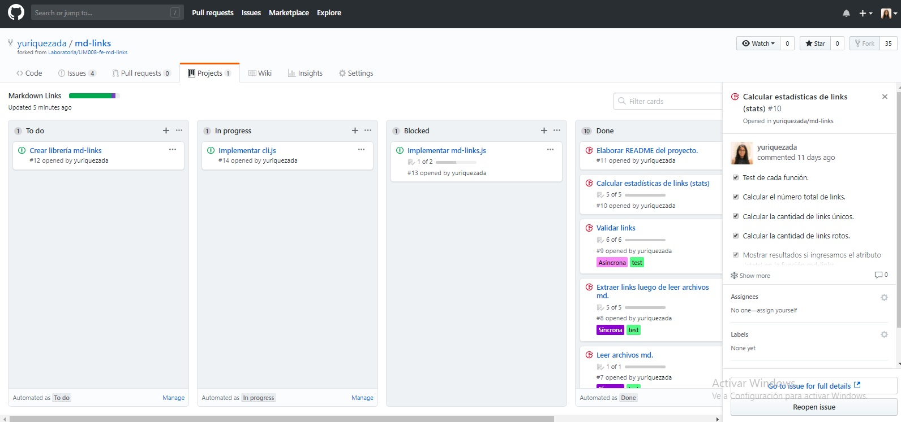
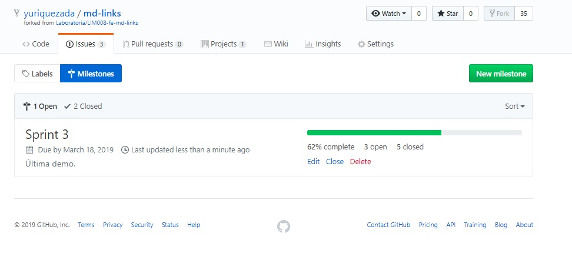

# MARKDOWN LINKS
## Preámbulo

La librería `md-links` es una herramienta que lee y analiza archivos con extensión `.md` (Markdown), con el fin de verificar los links que contengan y reportar sus estadísticas de validación.

## Instalación

El módulo puede importarse en otros scripts de Node.js a través de:

`require('md-links')`
### JavaScript API

#### `mdLinks(path, options)`

##### Argumentos

- `path`: Ruta absoluta o relativa al archivo o directorio. 
- `options`: Un objeto con las siguientes propiedades:
  * `validate`: Booleano que determina si se desea validar los links
    encontrados.

##### Valor de retorno

Cada objeto representa un link y contiene
las siguientes propiedades:

- `href`: URL encontrada.
- `text`: Texto que aparecía dentro del link (`<a>`).
- `route`: Ruta del archivo donde se encontró el link.

#### Ejemplo

```js
const mdLinks = require("md-links");

mdLinks("./some/example.md")
  .then(links => {
    // => [{ href, text, file }]
  })
  .catch(console.error);

mdLinks("./some/example.md", { validate: true })
  .then(links => {
    // => [{ href, text, file, status, ok }]
  })
  .catch(console.error);

mdLinks("./some/dir")
  .then(links => {
    // => [{ href, text, file }]
  })
  .catch(console.error);
```

## CLI (Command Line Interface - Interfaz de Línea de Comando)
El ejecutable podra ejecutarse de la siguiente manera a través de la terminal:

`md-links <path-to-file> [options]`

Por ejemplo:

```sh
$ md-links ./some/example.md --validate
$ md-links ./some/example.md --stats
$ md-links ./some/example.md --v --s
```

## Opciones
`--validate`

Si pasamos la opción --validate, el módulo debe hacer una petición HTTP para averiguar si el link funciona o no. Si el link resulta en una redirección a una URL que responde ok, entonces consideraremos el link como ok.

Por ejemplo:

```sh
$ md-links ./some/example.md --validate
./some/example.md http://algo.com/2/3/ ok 200 Link a algo
./some/example.md https://otra-cosa.net/algun-doc.html fail 404 algún doc
./some/example.md http://google.com/ ok 301 Google
```

El _output_ en este caso incluye la palabra `ok` o `fail` después de
la URL, así como el status de la respuesta recibida a la petición HTTP a dicha
URL.

`--stats`

Si pasamos la opción --stats, el output (salida) será un texto con estadísticas básicas sobre los links.

```sh
$ md-links ./some/example.md --stats
Total: 3
Unique: 3
```


`--stats --validate` 

También podemos combinar --stats y --validate para obtener estadísticas que necesiten de los resultados de la validación.

```sh
$ md-links ./some/example.md --stats --validate
Total: 3
Unique: 3
Broken: 1
```

## Algoritmo

Se creó el diagrama en la página web de Lucidchart, de esta forma se puede entender la lógica de nuestra librería y tener una idea estructurada de la misma, y la página web nos ayuda en facilitar cada modificación que se haga conforme transcurra la elaboración de la librería.



## Board del Backlog

Se creó un proyecto en GitHub para la organización y planificación del mismo, haciendo uso de milestones (por sprint), issues para asignar tareas por funciones y dentro de cada una un checklist con tareas más pequeñas.

- Project


- Milestones
